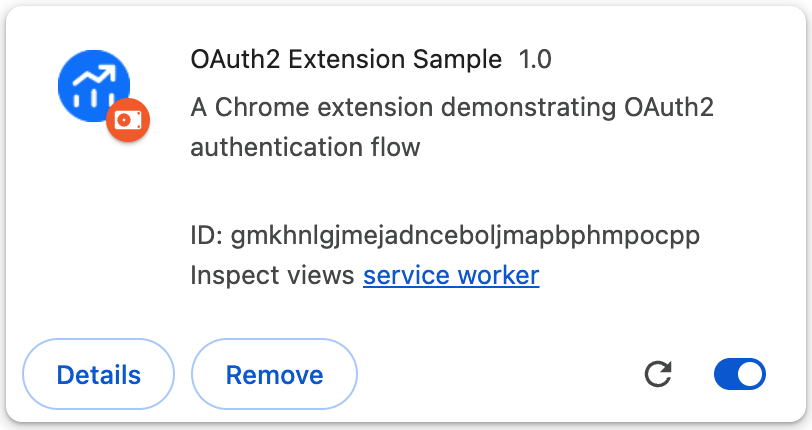

# OAuth2 Extension Sample


This Chrome extension demonstrates how to implement Strategy Library OAuth2 authentication in a Chrome extension. It provides a simple interface for users to authenticate with the Strategy Library and manage their authentication state.

## Features

- OAuth2 authentication flow implementation
  - Authorization code flow with PKCE (Proof Key for Code Exchange)
  - Token refresh mechanism
  - Secure token storage
- User Interface
  - Clean and intuitive design
  - Token display functionality
  - Status message feedback
- Security Features
  - PKCE implementation for enhanced security
  - Secure token storage using Chrome's storage API
  - Automatic token refresh handling
  - Token refresh on demand
  - Error handling and user feedback

## Prerequisites

- A Chrome browser
- A Strategy Library
  - The library is running
  - OAuth2 has been enabled and is properly configured
  - Trust Relationship has been enabled between Web Server and Intelligence Server
- Extension require cross-domain access
  - The Extension URL has been added to the Library Security Setting:
    - 
  - Note your extension ID from Chrome's extension management page
    - 

For how to Configure OAuth2 in Strategy Library, please reference to Strategy Documentation.

## Configuration

Update the following configuration in `popup.js`:

```javascript
const config = {
  clientId: 'YOUR_CLIENT_ID',           // Your OAuth2 client ID
  clientSecret: 'YOUR_CLIENT_SECRET',   // Your OAuth2 client secret
  redirectUri: chrome.identity.getRedirectURL(),
  authEndpoint: 'http://hostname:8080/MicroStrategyLibrary/oauth2/authorize', // Your OAuth2 authorization endpoint
  tokenEndpoint: 'http://hostname:8080/MicroStrategyLibrary/oauth2/token',    // Your OAuth2 token endpoint
  scope: 'offline_access'
};
```

## Security Implementation

This extension implements PKCE (Proof Key for Code Exchange) for enhanced security:

1. **PKCE Flow**:
   - Generates a secure random code verifier
   - Creates a code challenge using SHA-256
   - Includes challenge in authorization request
   - Uses verifier in token exchange
   - Cleans up verifier after successful authentication

2. **Security Benefits**:
   - Prevents authorization code interception attacks
   - Eliminates need for client secrets
   - Uses secure random values
   - Implements proper challenge/verifier flow

3. **Token Management**:
   - Secure storage using Chrome's storage API
   - Automatic token refresh
   - Manual refresh capability
   - Proper error handling

## Setup Instructions

1. **Configure OAuth2 Provider**
  - Configure a new Client in Library OAuth2 Configuration and records these values
    - Authorization Endpoint
    - Token Endpoint
    - Client ID
    - Client Secret
   - Configure the redirect URI:
     ```
     https://<your-extension-id>.chromiumapp.org/
     ```
   - Note your extension ID from Chrome's extension management page

2. **Load the Extension**
   - Open Chrome and go to `chrome://extensions/`
   - Enable "Developer mode" in the top right
   - Click "Load unpacked" and select the extension directory

## Usage

1. Click the extension icon in your Chrome toolbar
2. Click "Login with OAuth2" to start the authentication process
3. Complete the OAuth2 flow in the popup window
4. Once authenticated, you'll see:
   - Authentication Status
     - A "Logout" button
     - A "Refresh Access Token" button
     - Status messages for all operations
5. Click "Refresh Access Token" to:
   - Get a new access token
   - View the current token in the popup
6. Use the "Logout" button to end your session

## UI Screenshots

### Login Screen


### Authenticated View


### Token Display


## Security Considerations

- **PKCE Implementation**
  - Secure code verifier generation
  - SHA-256 code challenge
  - Proper challenge/verifier flow
  - Secure storage of verifier

- **Token Management**
  - Secure storage using Chrome's storage API
  - Automatic token refresh
  - Manual refresh capability
  - Proper error handling

- **Data Protection**
  - Sensitive data is never exposed in the UI
  - All network requests are made over HTTPS
  - Secure token handling and storage

## Code Structure

- Core Files
  - `manifest.json`: Extension configuration and permissions
  - `popup.html`: User interface for the extension
  - `popup.js`: Handles UI interactions and OAuth2 flow with PKCE
  - `background.js`: Manages token refresh and background tasks
- Resources
  - `images/`: Contains extension icons

## Development

To modify the extension:

1. Make your changes to the source files
2. Go to `chrome://extensions/`
3. Click the refresh icon on the extension card
4. Test your changes

## Troubleshooting

Common issues and solutions:

1. **Authentication Fails**
   - Check your OAuth2 credentials
     - Verify Client ID and Secret
     - Check scope configuration
   - Verify the redirect URI is correctly configured
   - Check the browser console for error messages

2. **Token Refresh Issues**
   - Verify your refresh token is valid
   - Check the token endpoint configuration
   - Look for network errors in the console

3. **Extension Not Loading**
   - Ensure all required files are present
   - Check manifest.json for syntax errors
   - Verify file permissions

## Contributing

Feel free to submit issues and enhancement requests!

## License

This project is licensed under the MIT License - see the LICENSE file for details. 