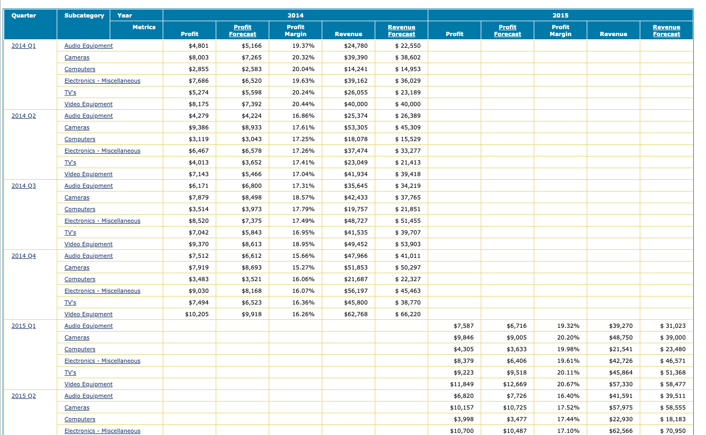
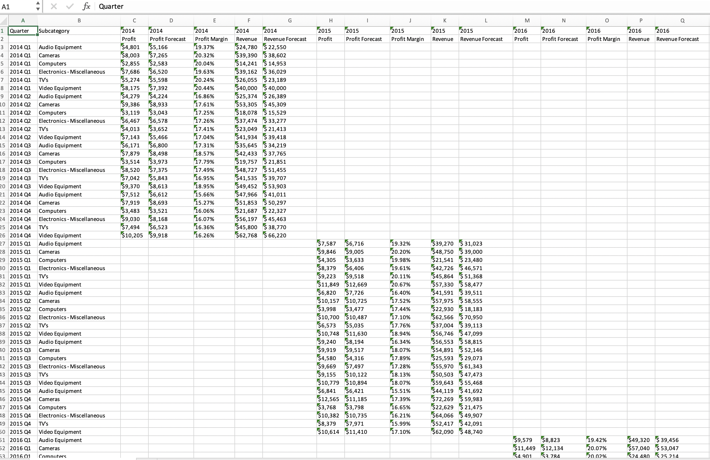
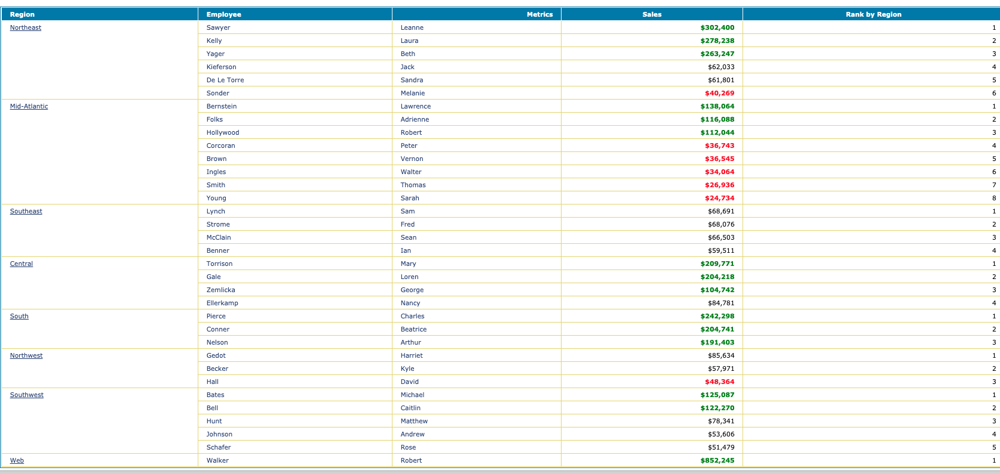
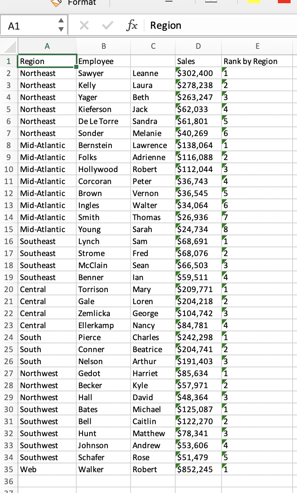

# Fetch data from MicroStrategy API and export into Excel sheet

This client code outlines the API workflow for the how to fetch report data from MicroStrategy Data API and how to export into excel sheet.

This client code demonstration apply on non cross-tab, cross-tab and multi-form templates report.

## Workflows for retrieving data

1. Login

    ```http
    POST /auth/login
    ```

2. Create Instance of report

   In order to retrieve data an instance must be created. For Reports & Cubes this is done in the same step. However for Dossiers, this step is an additional REST API call.

   * [Create report Instance](https://demo.microstrategy.com/MicroStrategyLibrary/api-docs/index.html#!/Reports/createReportInstance_0)

        This API will execute the report and return data based on the offset/limit parameters. The response body will contain a instance id which can be used in subsequent GET calls for paging through the results.

        ```http
        POST /v2/reports/{id}/instances
        ```

        This API creates an instance of a report, the instance ID and results are returned. The instance ID can be used in subsequent GET requests to page through the results in desired chunk size. This API has parameters which can be specified which alter the output of the response, they include; pagination, metric limit, view filter, requested objects, and sorting. All of these request parameters are optional.

### Query parameters

        * **offset:** is the start point of your response. For example, if offset=2, it will return the report data beginning with the second record. The default value is 0.

        * **limit:** is the end point of your response. For example, if limit =500, it will return only 500 records of the report. The default value is 1000.

        URL:

        ```
        https://demo.microstrategy.com/MicroStrategyLibrary/api/v2/reports/9A080A2411D63D9FC0009CAD9AD9374F/instances
        ```

        Headers:

        ```http
        X-MSTR-AuthToken: rjbi5adll1inv0rhj0onf7p8n
        X-MSTR-ProjectID: B7CA92F04B9FAE8D941C3E9B7E0CD754
        ```

        Response:

        HTTP status code 200

3. Get report data for specific instance

   * [Get Report data](https://demo.microstrategy.com/MicroStrategyLibrary/api-docs/index.html#!/Reports/executeReport)

        Get the results of a previously created report instance, using the in-memory report instance created by a POST /reports/{reportId}/instances request or after did manipulation by PUT /v2/reports/{reportsId}/instances/{instanceId}

        ```http
        GET /v2/reports/{id}/instances/{instanceId}
        ```

        URL:

        ```
        https://demo.microstrategy.com/MicroStrategyLibrary/api/v2/reports/9A080A2411D63D9FC0009CAD9AD9374F/instances/49F2AEFA11EA11270CD20080EFA59B90?offset=0&limit=1000
        ```

        ```http
        X-MSTR-AuthToken: rjbi5adll1inv0rhj0onf7p8n
        X-MSTR-ProjectID: B7CA92F04B9FAE8D941C3E9B7E0CD754
        ```

        Response Code: 200

## Non-Cross tab report

### Report Layout


### Exported into Excel sheet


## Cross tab report

### Report Layout



### Exported into Excel sheet



## Multi-form template Report

### Report Layout



### Exported into Excel sheet



### Config.properties

Please make necessary changes in Config.properties such as Base url, user name, password, report Id.
If in your development environment have this file already, then put all these setting parameter in configuration file, and make necessary changes.
